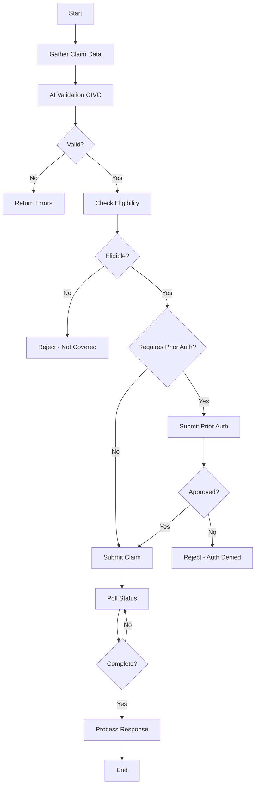

# NPHIES Integration Guide - Enhanced Implementation
**BrainSAIT-NPHIES-GIVC Platform**  
**Al Hayat National Hospital**  
**Version 2.0 - Based on NPHIES Implementation Guide v2.0**

---

## 📚 Overview

This guide provides comprehensive information for implementing NPHIES (National Platform for Health Insurance Exchange Services) integration based on official NPHIES documentation and FHIR standards.

### NPHIES Platform Architecture

- **Production URL**: `https://HSB.nphies.sa`
- **SSO Authentication**: `https://sso.nphies.sa`
- **Realm**: `sehaticoreprod`
- **Client ID**: `community`
- **Standard**: FHIR R4 (HL7 FHIR)
- **Message Format**: FHIR Bundle (type=message)

---

## 🔐 Authentication Flow

### OpenID Connect Authentication

1. **Token Endpoint**:
   ```
   POST https://sso.nphies.sa/auth/realms/sehaticoreprod/protocol/openid-connect/token
   ```

2. **Grant Types**:
   - `client_credentials` - For system-to-system communication
   - `password` - For user authentication (with username/password)

3. **Certificate-Based Authentication**:
   - Required for production environment
   - Certificate file: `nphies_production.pem`
   - Private key: `nphies_production_key.pem`
   - TLS/SSL mutual authentication

4. **Token Response**:
   ```json
   {
     "access_token": "eyJhbGciOiJSUzI1NiIsInR5cCI...",
     "token_type": "Bearer",
     "expires_in": 3600,
     "refresh_token": "eyJhbGciOiJIUzI1NiIsInR5cCI..."
   }
   ```

5. **Using Access Token**:
   ```http
   Authorization: Bearer {access_token}
   Content-Type: application/fhir+json
   Accept: application/fhir+json
   ```

---

## 🏥 NPHIES Use Cases

### 1. Eligibility Verification

**Purpose**: Verify patient insurance coverage before service delivery

**Endpoint**: `/eligibility/v1/check`

**FHIR Resources Required**:
- `CoverageEligibilityRequest` (main resource)
- `Patient` (patient demographics)
- `Coverage` (insurance policy)
- `Organization` (provider/hospital)

**Request Structure**:
```json
{
  "resourceType": "Bundle",
  "type": "message",
  "entry": [
    {
      "resource": {
        "resourceType": "MessageHeader",
        "eventCoding": {
          "system": "http://nphies.sa/terminology/CodeSystem/ksa-message-events",
          "code": "eligibility-request"
        },
        "source": {
          "endpoint": "http://provider.hospital.sa"
        }
      }
    },
    {
      "resource": {
        "resourceType": "CoverageEligibilityRequest",
        "status": "active",
        "purpose": ["validation"],
        "patient": {
          "reference": "Patient/patient-id"
        },
        "servicedDate": "2024-01-15",
        "insurance": [{
          "coverage": {
            "reference": "Coverage/insurance-id"
          }
        }],
        "provider": {
          "reference": "Organization/10000000000988"
        }
      }
    }
  ]
}
```

**Response Fields**:
- `outcome`: "complete" | "error" | "partial"
- `insurance.coverage.benefitPeriod`: Coverage period
- `insurance.inforce`: Boolean - is coverage active
- `insurance.item[]`: Covered benefits

**Best Practices**:
- ✅ Always check eligibility before prior authorization
- ✅ Include eligibility reference in authorization requests
- ✅ Cache eligibility results for 24 hours
- ✅ Re-check if service date changes

---

### 2. Prior Authorization

**Purpose**: Pre-approval for planned services (hospital admissions, surgeries, high-cost procedures)

**Endpoint**: `/priorauth/v1/create`

**Five Authorization Types**:

1. **Institutional Authorization**
   - Hospital-based services
   - Inpatient admissions
   - Surgical procedures
   - Emergency admissions

2. **Professional Authorization**
   - Outpatient physician services
   - Consultations
   - Diagnostic procedures

3. **Pharmacy Authorization**
   - Prescription medications
   - High-cost drugs
   - Specialty medications

4. **Dental Authorization**
   - Major dental procedures
   - Orthodontics
   - Dental surgeries

5. **Vision Authorization**
   - Optical services
   - Corrective lenses
   - Eye surgeries

**Request Structure**:
```json
{
  "resourceType": "Bundle",
  "type": "message",
  "entry": [
    {
      "resource": {
        "resourceType": "MessageHeader",
        "eventCoding": {
          "code": "priorauth-request"
        }
      }
    },
    {
      "resource": {
        "resourceType": "Claim",
        "status": "active",
        "type": {
          "coding": [{
            "system": "http://terminology.hl7.org/CodeSystem/claim-type",
            "code": "institutional"
          }]
        },
        "use": "preauthorization",
        "patient": {
          "reference": "Patient/patient-id"
        },
        "created": "2024-01-15T10:00:00Z",
        "provider": {
          "reference": "Organization/10000000000988"
        },
        "priority": {
          "coding": [{
            "code": "normal"
          }]
        },
        "insurance": [{
          "sequence": 1,
          "focal": true,
          "coverage": {
            "reference": "Coverage/insurance-id"
          }
        }],
        "item": [
          {
            "sequence": 1,
            "productOrService": {
              "coding": [{
                "code": "service-code",
                "display": "Service Description"
              }]
            },
            "servicedDate": "2024-01-20",
            "quantity": {
              "value": 1
            },
            "unitPrice": {
              "value": 5000.00,
              "currency": "SAR"
            }
          }
        ]
      }
    }
  ]
}
```

**Response Fields**:
- `status`: "active" | "cancelled" | "draft"
- `outcome`: "queued" | "complete" | "error" | "partial"
- `preAuthRef`: Authorization reference number
- `preAuthPeriod`: Valid period for authorization
- `item[].adjudication[]`: Approval status per item

**Required Extensions**:
- `extension-adjudication-outcome`: Approval outcome
- `extension-transferAuthorizationNumber`: Transfer auth number
- `extension-transferAuthorizationPeriod`: Transfer validity period
- `extension-transferAuthorizationProvider`: Transfer provider

**Mandatory Information**:
- ✅ Eligibility check reference (if performed)
- ✅ Days supply (for medications)
- ✅ Diagnosis codes (ICD-10)
- ✅ Service/procedure codes
- ✅ Estimated costs

---

### 3. Claims Submission

**Purpose**: Submit claims for services already provided

**Endpoint**: `/claim/v1/submit`

**Claim Types**:
- **Institutional**: Hospital services
- **Professional**: Physician services
- **Pharmacy**: Medication dispensing
- **Dental**: Dental services
- **Vision**: Optical services

**Request Structure**:
```json
{
  "resourceType": "Bundle",
  "type": "message",
  "entry": [
    {
      "resource": {
        "resourceType": "MessageHeader",
        "eventCoding": {
          "code": "claim-request"
        }
      }
    },
    {
      "resource": {
        "resourceType": "Claim",
        "status": "active",
        "type": {
          "coding": [{
            "code": "institutional"
          }]
        },
        "use": "claim",
        "patient": {
          "reference": "Patient/patient-id"
        },
        "billablePeriod": {
          "start": "2024-01-15",
          "end": "2024-01-17"
        },
        "created": "2024-01-17T15:00:00Z",
        "provider": {
          "reference": "Organization/10000000000988"
        },
        "priority": {
          "coding": [{
            "code": "normal"
          }]
        },
        "insurance": [{
          "sequence": 1,
          "focal": true,
          "coverage": {
            "reference": "Coverage/insurance-id"
          }
        }],
        "diagnosis": [
          {
            "sequence": 1,
            "diagnosisCodeableConcept": {
              "coding": [{
                "system": "http://hl7.org/fhir/sid/icd-10",
                "code": "J18.9",
                "display": "Pneumonia, unspecified"
              }]
            }
          }
        ],
        "item": [
          {
            "sequence": 1,
            "productOrService": {
              "coding": [{
                "code": "99213"
              }]
            },
            "servicedDate": "2024-01-15",
            "quantity": {
              "value": 1
            },
            "unitPrice": {
              "value": 150.00,
              "currency": "SAR"
            },
            "net": {
              "value": 150.00,
              "currency": "SAR"
            }
          }
        ],
        "total": {
          "value": 150.00,
          "currency": "SAR"
        }
      }
    }
  ]
}
```

**Response Structure**:
```json
{
  "resourceType": "ClaimResponse",
  "status": "active",
  "type": {
    "coding": [{
      "code": "institutional"
    }]
  },
  "use": "claim",
  "patient": {
    "reference": "Patient/patient-id"
  },
  "created": "2024-01-17T15:05:00Z",
  "insurer": {
    "reference": "Organization/insurer-id"
  },
  "requestor": {
    "reference": "Organization/10000000000988"
  },
  "outcome": "complete",
  "disposition": "Claim approved",
  "item": [
    {
      "itemSequence": 1,
      "adjudication": [
        {
          "category": {
            "coding": [{
              "code": "approved"
            }]
          },
          "amount": {
            "value": 150.00,
            "currency": "SAR"
          }
        }
      ]
    }
  ]
}
```

---

### 4. Communication

**Purpose**: Send/receive messages and attachments related to claims

**Endpoint**: `/communication/v1/send`

**Use Cases**:
- Submit additional clinical documentation
- Request clarification from payer
- Respond to payer queries
- Attach lab results, imaging reports

**Request Structure**:
```json
{
  "resourceType": "Communication",
  "status": "completed",
  "category": [{
    "coding": [{
      "code": "claim-attachment"
    }]
  }],
  "about": [{
    "reference": "Claim/claim-id"
  }],
  "sent": "2024-01-18T10:00:00Z",
  "payload": [
    {
      "contentString": "Attached lab results for claim review"
    },
    {
      "contentAttachment": {
        "contentType": "application/pdf",
        "data": "base64-encoded-data",
        "title": "Lab Results"
      }
    }
  ]
}
```

---

### 5. Status Polling

**Purpose**: Check status of submitted transactions

**Endpoint**: `/poll/v1/status`

**Query Parameters**:
- `bundle={bundle-id}` - Transaction bundle ID
- `claim={claim-id}` - Specific claim ID

**Response**:
```json
{
  "resourceType": "Bundle",
  "type": "searchset",
  "total": 1,
  "entry": [
    {
      "resource": {
        "resourceType": "Task",
        "status": "completed",
        "businessStatus": {
          "coding": [{
            "code": "processed"
          }]
        },
        "focus": {
          "reference": "Claim/claim-id"
        }
      }
    }
  ]
}
```

**Polling Best Practices**:
- ✅ Poll every 5-10 minutes for pending claims
- ✅ Implement exponential backoff
- ✅ Stop polling after status changes to final state
- ✅ Cache results to avoid duplicate polls

---

## 🎯 Implementation Best Practices

### 1. Message Bundle Structure

**All NPHIES requests MUST follow this structure**:

```json
{
  "resourceType": "Bundle",
  "type": "message",
  "entry": [
    {
      "fullUrl": "MessageHeader/msg-header-id",
      "resource": {
        "resourceType": "MessageHeader",
        "id": "msg-header-id",
        "eventCoding": {
          "system": "http://nphies.sa/terminology/CodeSystem/ksa-message-events",
          "code": "claim-request"
        },
        "source": {
          "endpoint": "http://provider.hospital.sa"
        },
        "focus": [{
          "reference": "Claim/claim-id"
        }]
      }
    },
    {
      "fullUrl": "Claim/claim-id",
      "resource": {
        "resourceType": "Claim",
        "id": "claim-id",
        ...
      }
    }
  ]
}
```

**Key Requirements**:
- MessageHeader MUST be first entry in bundle
- MessageHeader.eventCoding specifies operation type
- All referenced resources MUST be included in bundle
- Use NPHIES-profiled resources (validation required)

### 2. Resource Identifiers

**Organization (Hospital)**:
```json
{
  "reference": "Organization/10000000000988",
  "identifier": {
    "system": "http://nphies.sa/identifier/provider-license",
    "value": "7000911508"
  }
}
```

**Patient Identifier Types**:
- National ID (Saudi citizens)
- Iqama (Residents)
- Passport (Visitors)
- Border Number (Emergency cases)

```json
{
  "identifier": {
    "type": {
      "coding": [{
        "system": "http://terminology.hl7.org/CodeSystem/v2-0203",
        "code": "PPN"
      }]
    },
    "system": "http://nphies.sa/identifier/patient-id",
    "value": "1234567890"
  }
}
```

### 3. Error Handling

**Common Error Codes**:
- `BV-00114`: Missing required field
- `BV-00333`: Invalid resource reference
- `BV-00391`: Invalid coding system
- `BV-00505`: Business validation failed
- `BV-00521`: Authorization expired
- `BV-00853`: Duplicate submission
- `BV-00854`: Invalid period

**Error Response Example**:
```json
{
  "resourceType": "OperationOutcome",
  "issue": [
    {
      "severity": "error",
      "code": "required",
      "diagnostics": "Missing required field: patient.identifier",
      "expression": ["Claim.patient.identifier"]
    }
  ]
}
```

**Error Handling Strategy**:
```python
try:
    response = await submit_to_nphies(claim_data)
    
    if response.status_code == 200:
        # Success - process response
        result = response.json()
        
    elif response.status_code == 400:
        # Validation error - fix and resubmit
        errors = response.json()['issue']
        log.error(f"Validation failed: {errors}")
        
    elif response.status_code == 401:
        # Authentication failed - refresh token
        await refresh_access_token()
        
    elif response.status_code == 422:
        # Business rule violation - review data
        log.error("Business validation failed")
        
    elif response.status_code >= 500:
        # Server error - retry with backoff
        await retry_with_backoff()
        
except httpx.TimeoutException:
    # Network timeout - retry
    log.warning("Request timeout - retrying...")
    
except Exception as e:
    # Unexpected error - log and alert
    log.error(f"Unexpected error: {str(e)}")
```

### 4. Data Validation

**Pre-Submission Checklist**:

✅ **Patient Information**:
- Valid patient identifier (10 digits)
- Patient name matches ID
- Contact information provided

✅ **Insurance Coverage**:
- Policy is active
- Coverage dates include service date
- Patient eligibility verified

✅ **Service Details**:
- Valid service/procedure codes
- Diagnosis codes (ICD-10)
- Service dates are valid (not future)
- Prices are reasonable

✅ **Provider Information**:
- Hospital license number: 7000911508
- NPHIES ID: 10000000000988
- Provider credentials valid

✅ **Extensions**:
- Eligibility reference included
- Transfer authorization (if applicable)
- Days supply (for medications)

### 5. Performance Optimization

**Caching Strategy**:
```python
# Cache eligibility results
eligibility_cache = {
    'patient_id': {
        'insurance_id': {
            'result': {...},
            'cached_at': datetime,
            'expires_at': datetime + 24h
        }
    }
}

# Cache access tokens
token_cache = {
    'access_token': '...',
    'expires_at': datetime + 3600s
}
```

**Batch Processing**:
- Submit multiple claims in parallel
- Use async/await for concurrent requests
- Limit concurrent connections to 10-20
- Implement circuit breaker pattern

**Connection Pooling**:
```python
client = httpx.AsyncClient(
    limits=httpx.Limits(
        max_keepalive_connections=10,
        max_connections=20
    ),
    timeout=httpx.Timeout(60.0)
)
```

---

## 🔒 Security Best Practices

### Certificate Management

1. **Storage**:
   - Store certificates in secure directory: `./certificates/`
   - Set file permissions: Read-only for application user
   - Never commit certificates to version control

2. **Rotation**:
   - Monitor certificate expiration
   - Renew 30 days before expiry
   - Test new certificates in sandbox first

3. **Password Protection**:
   - Use environment variables for certificate passwords
   - Encrypt .env file in production
   - Use secret management service (Azure Key Vault, AWS Secrets Manager)

### Data Protection

1. **Encryption**:
   - TLS 1.2+ for all NPHIES communications
   - Encrypt sensitive data at rest
   - Use HTTPS for all API endpoints

2. **Access Control**:
   - Implement role-based access control (RBAC)
   - Audit all NPHIES transactions
   - Log authentication attempts

3. **PII Handling**:
   - Minimize patient data in logs
   - Mask sensitive information
   - Comply with HIPAA/Saudi DPA regulations

---

## 📊 Monitoring & Analytics

### Key Metrics to Track

1. **Transaction Metrics**:
   - Submission success rate
   - Average processing time
   - Error rate by type
   - Retry attempts

2. **Business Metrics**:
   - Claims submitted per day
   - Approval rate by insurance company
   - Average claim amount
   - Prior authorization usage

3. **Technical Metrics**:
   - API response time
   - Certificate expiration date
   - Token refresh frequency
   - Circuit breaker trips

### Logging Best Practices

```python
# Log all NPHIES transactions
log.info(f"NPHIES claim submission", extra={
    'claim_id': claim_id,
    'patient_id': patient_id,
    'insurance_id': insurance_id,
    'total_amount': total_amount,
    'submission_time': datetime.utcnow(),
    'response_time_ms': response_time
})

# Log errors with context
log.error(f"NPHIES submission failed", extra={
    'claim_id': claim_id,
    'error_code': error_code,
    'error_message': error_message,
    'retry_count': retry_count
})
```

---

## 🚀 Integration Workflow

### Complete Claim Submission Flow



### Recommended Implementation Steps

1. **Phase 1: Authentication Setup**
   - Configure certificates
   - Test token generation
   - Implement token refresh logic

2. **Phase 2: Eligibility Integration**
   - Build eligibility checker
   - Implement caching
   - Test with real patient data

3. **Phase 3: Prior Authorization**
   - Identify services requiring auth
   - Build authorization request
   - Handle approval/denial workflow

4. **Phase 4: Claims Submission**
   - Implement claim builder
   - Add GIVC AI validation
   - Test end-to-end flow

5. **Phase 5: Status & Communication**
   - Implement polling mechanism
   - Add communication endpoints
   - Build attachment handler

6. **Phase 6: Monitoring & Optimization**
   - Add comprehensive logging
   - Implement metrics collection
   - Optimize performance

---

## 📝 NPHIES-Specific Enhancements for Our Platform

### Enhanced NPHIES Connector

Our implementation includes:

✅ **Certificate-Based Authentication**
- Automatic certificate loading
- SSL context creation
- Mutual TLS authentication

✅ **FHIR Resource Builders**
- `_build_fhir_claim()` - Claim resource
- `_build_claim_items()` - Service items
- Validation against NPHIES profiles

✅ **Comprehensive API Coverage**
- Eligibility checking
- Prior authorization
- Claims submission
- Communication
- Status polling

✅ **Error Handling**
- Retry logic with exponential backoff
- Circuit breaker pattern
- Detailed error logging

### GIVC AI Integration with NPHIES

Our GIVC service enhances NPHIES integration:

✅ **Pre-Submission Validation**
- Check required fields
- Validate data formats
- Ensure NPHIES compliance

✅ **Smart Field Completion**
- Auto-fill provider information
- Suggest diagnosis codes
- Complete missing fields

✅ **Error Prevention**
- Detect common NPHIES errors
- Validate date ranges
- Check pricing anomalies

✅ **Optimization Recommendations**
- Suggest bundling opportunities
- Identify prior auth requirements
- Optimize service coding

---

## 🎓 Training Resources

### Official NPHIES Resources

1. **NPHIES Portal**: https://portal.nphies.sa
2. **Implementation Guide**: NPHIES Implementation Guide v2.0
3. **FHIR Profiles**: http://nphies.sa/fhir/ksa/nphies-fs/
4. **Support**: Contact NPHIES support team

### Internal Resources

1. **API Documentation**: http://localhost:8000/docs
2. **Integration Tests**: `tests/test_nphies.py`
3. **Example Requests**: `examples/nphies_examples.json`
4. **Troubleshooting Guide**: `docs/TROUBLESHOOTING.md`

---

## 📞 Support

### NPHIES Technical Support
- Portal: https://portal.nphies.sa
- Documentation: Available on portal
- Training: Contact NPHIES team

### Internal Support
- BrainSAIT Team
- IT Department
- Integration Support Team

---

**Last Updated**: January 2024  
**NPHIES Version**: v2.0  
**Platform Version**: BrainSAIT-NPHIES-GIVC v2.0
